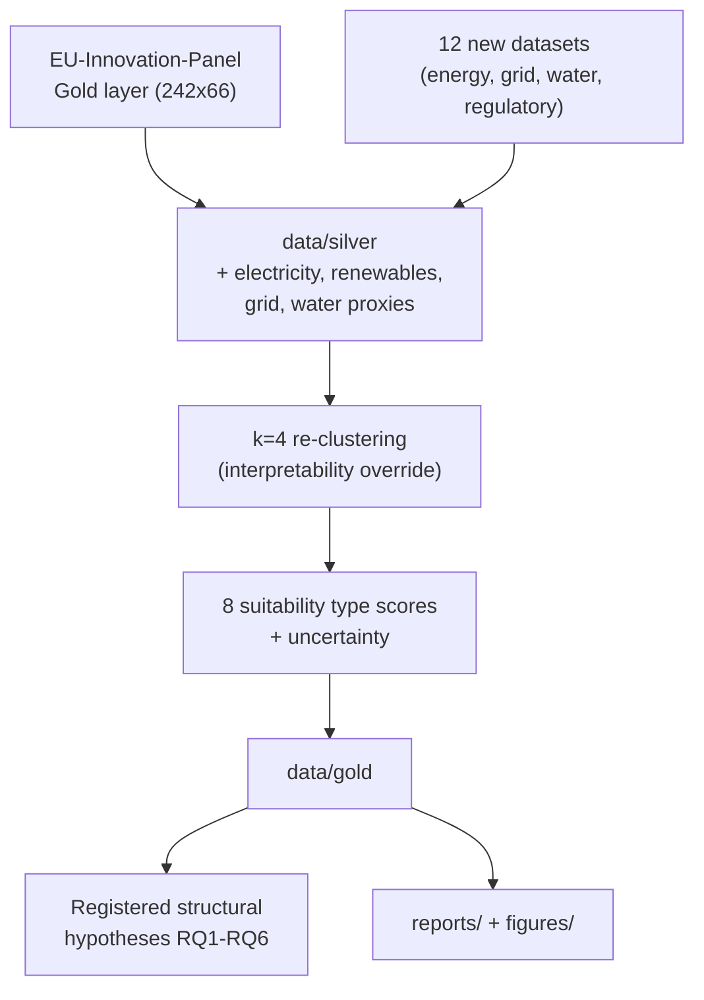

# EU MegaCampus Siting Intelligence

Quantitative site-intelligence analysis identifying EU NUTS2 regions whose structural characteristics are associated with hosting eight disruptor ecosystem types: AI/ML hubs, biotech clusters, semiconductor corridors, cleantech zones, hyperscale data-centre hubs, HALEU/advanced-nuclear industrial bases, deep-tech robotics campuses, and quantum/photonics research anchors.

Operates under a **strategic intelligence** epistemological contract: composite suitability indices, shortlists, and structural threshold analyses are explicitly in scope, but findings are framed as descriptive associations — never causal claims (`X causes site success`).

## Relationship to EU-Innovation-Panel

This project consumes the [EU-Innovation-Panel](https://github.com/andrm101/eu-innovation-panel) Gold layer (242 NUTS2 regions × 66 features) as its upstream base, then re-clusters with **k=4** — an intentional interpretability override from the base study's k=2 solution, explicitly documented and gated on silhouette/ARI reporting.

## Eight disruptor ecosystem types

| ID | Type | Primary structural indicators |
|---|---|---|
| T1 | AI / Machine Learning Hub | HRST, KIS LQ, BERD, tertiary attainment, broadband |
| T2 | Biotechnology / Life Sciences | KIS hi-tech LQ, university R&D, HRST, EPO patents |
| T3 | Semiconductors / Advanced Electronics | Advanced mfg LQ, industrial employment, energy cost, transport |
| T4 | Cleantech / Green Technology | Renewable energy share, energy LQ, GERD, BERD |
| T5 | Hyperscale Data Centre Hub | Grid headroom, electricity cost (inverse), broadband, water, land |
| T6 | HALEU / Advanced Nuclear Industrial Base | Nuclear capacity proximity, chemical LQ, regulatory flag, grid capacity |
| T7 | Deep-Tech Robotics Campus | Machinery/automotive LQ, university R&D, CORDIS EIC funding, HRST |
| T8 | Quantum / Photonics Research Anchor | Patent density, EuroHPC proximity, national quantum programme flag |

## Architecture



## Pre-registered structural hypotheses (Popper contract)

Six falsifiable conjectures (RQ1–RQ6) are pre-registered before testing — e.g. RQ1 tests whether frontier-innovation-archetype regions show higher composite suitability for T1/T2 than other archetypes (falsifier: no significant Mann-Whitney gradient, p > 0.05); RQ5 tests temporal stability of top-quintile regions across Eurostat vintages. Full list in `CLAUDE.md`.

## Data architecture (medallion)

- **Bronze** (`data/bronze/`) — raw files as received, immutable
- **Silver** (`data/silver/`) — upstream Gold + new energy/grid/water features, NUTS2-aligned
- **Gold** (`data/gold/`) — Silver + k=4 cluster assignments + 8 type scores + uncertainty

## Language contract

Permitted: "structurally favourable", "shortlisted", "composite suitability index ≥ 0.70", "structural pre-conditions associated with". Forbidden: causal or legally unhedged siting claims.

## Running it

```bash
docker build -t eu-megacampus:latest .
make reproduce
```

Requires the EU-Innovation-Panel Gold parquet at `../EU-Innovation-Panel/data/gold/region_profiles_gold.parquet`.
