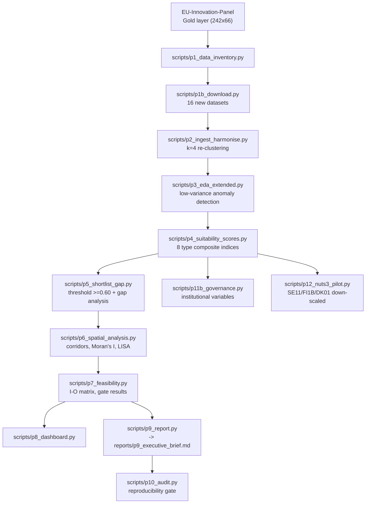

# EU MegaCampus Siting Intelligence

   

> Quantitative site-intelligence analysis identifying EU NUTS2 regions whose structural characteristics are associated with hosting eight disruptor ecosystem types — AI/ML hubs, biotech clusters, semiconductor corridors, cleantech zones, hyperscale data-centre hubs, HALEU/advanced-nuclear industrial bases, deep-tech robotics campuses, and quantum/photonics research anchors.

Operates under a **strategic intelligence** epistemological contract: composite suitability indices, shortlists, and structural threshold analyses are explicitly in scope, but findings are framed as descriptive associations — never causal claims (`X causes site success`).

Consumes the [EU-Innovation-Panel](https://github.com/andrm101/eu-innovation-panel) Gold layer (242 NUTS2 × 66 features) as its upstream base, then re-clusters at **k=4** — an intentional interpretability override from the base study's k=2 solution, explicitly documented and gated on silhouette/ARI reporting.

---

## Key findings

- 8 disruptor types scored across **242 NUTS2 regions**; shortlist counts (≥0.60 rescaled threshold): T1:49 T2:46 T3:75 T4:77 T5:21 T6:38 **T7:31** **T8:106**
- T3 (Semiconductors) shortlist nearly doubled (35→75) after fixing two real Eurostat data-ingestion bugs — a wrong dataset code (rail passengers vs. freight) and a missing `geo` column silently collapsing 26 countries into one
- 23 spatial corridors identified (9 cross-border), Moran's I 0.56–0.89 across all 8 types, all p<0.01
- Governance/institutional extension (P11b): 1 of 5 variables genuinely resolved at NUTS2 (rest honestly recorded as DATA GAPs, not fabricated)
- NUTS3 down-scaling pilot (P12): 3 regions (Stockholm, Helsinki-Uusimaa, Hovedstaden) — a real location quotient and patent-density measure resolved at NUTS3; a claimed "artificial land" source was found to actually measure land-vs-water and correctly discarded rather than reported

## Eight disruptor ecosystem types

| ID | Type | Primary structural indicators |
|---|---|---|
| T1 | AI / Machine Learning Hub | HRST, KIS LQ, BERD, tertiary attainment, broadband |
| T2 | Biotechnology / Life Sciences | KIS hi-tech LQ, university R&D, HRST, EPO patents |
| T3 | Semiconductors / Advanced Electronics | Advanced mfg LQ, industrial employment, energy cost, transport |
| T4 | Cleantech / Green Technology | Renewable energy share, energy LQ, GERD, BERD |
| T5 | Hyperscale Data Centre Hub | Grid headroom, electricity cost (inverse), broadband, water, land |
| T6 | HALEU / Advanced Nuclear Industrial Base | Nuclear capacity proximity, chemical LQ, regulatory flag, grid capacity |
| T7 | Deep-Tech Robotics Campus | Machinery/automotive LQ, university R&D, CORDIS EIC funding, HRST |
| T8 | Quantum / Photonics Research Anchor | Patent density, EuroHPC proximity, national quantum programme flag |

---

## Architecture



## Pre-registered structural hypotheses (Popper contract)

Six falsifiable conjectures (RQ1–RQ6) are pre-registered before testing — e.g. RQ1 tests whether frontier-innovation-archetype regions show higher composite suitability for T1/T2 than other archetypes (falsifier: no significant Mann-Whitney gradient, p > 0.05); RQ5 tests temporal stability of top-quintile regions across Eurostat vintages. Full list in `CLAUDE.md`.

## Data architecture (medallion)

| Layer | Path | Contents |
|---|---|---|
| Bronze | `data/bronze/` | Raw files as received, immutable |
| Silver | `data/silver/` | Upstream Gold + new energy/grid/water features, NUTS2-aligned |
| Gold | `data/gold/` | Silver + k=4 cluster assignments + 8 type scores + uncertainty |

## Language contract

> Permitted: *"structurally favourable"*, *"shortlisted"*, *"composite suitability index ≥ 0.60"*, *"structural pre-conditions associated with"*. Forbidden: causal or legally unhedged siting claims.

---

## Status

| Phase | Result |
|---|---|
| P0–P9 | PASS |
| P10 — Reproducibility Audit | PASS |
| P11b — Governance Extension | PARTIAL PASS — 1/5 variables resolved at NUTS2, 4/5 honest DATA GAPs |
| P12 — NUTS3 Down-Scaling (Pilot) | PASS — 2/15 combined T5+T7 features genuinely resolved at NUTS3 |

Full phase-by-phase detail with exact numbers in `CLAUDE.md`.

---

## Running it

```bash
docker build -t eu-megacampus:latest .
make reproduce
```

Requires the EU-Innovation-Panel Gold parquet at `../EU-Innovation-Panel/data/gold/region_profiles_gold.parquet`.
